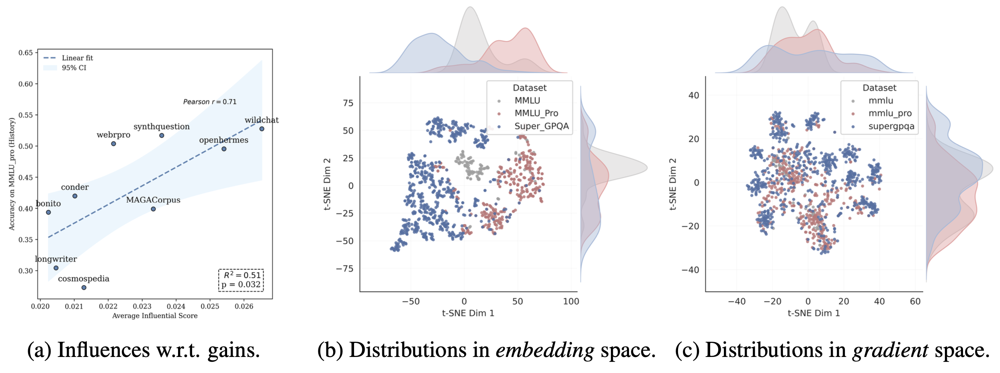
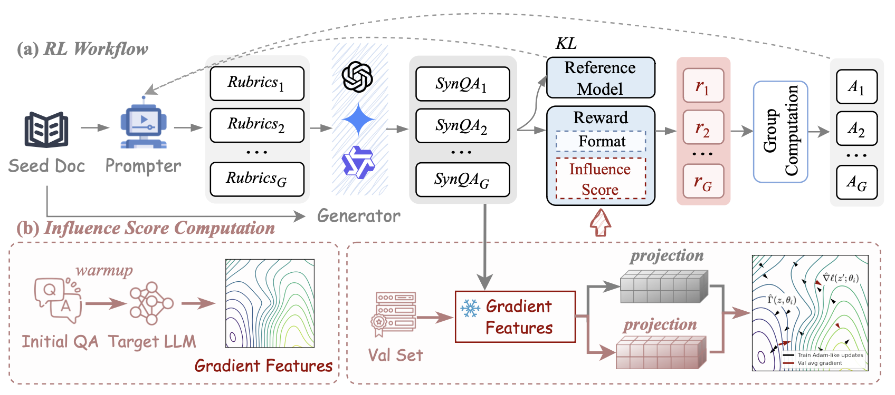

# OptimSyn [ICLR 2026]

**Influence-Guided Rubrics Optimization for Synthetic Data Generation** [arXiv:2604.00536](https://arxiv.org/abs/2604.00536)

---

## 1. Overview

High-quality synthetic data requires well-designed rubrics — the structured criteria that guide a teacher LLM when generating question-answer pairs.
Hand-crafted rubrics are brittle: they rely on domain expertise, fail to generalize across seeds, and cannot adapt as the target model improves.

**Why Influence Functions?**
The core idea is to measure, for each generated QA pair, how much it would improve the target model on a held-out validation set.
Formally, the influence of a training sample \(z\) on the validation loss \(\ell_\text{val}\) is estimated as:

$$\mathcal{I}(z) = -\nabla_\theta \ell_\text{val}(\theta)^\top H_\theta^{-1} \nabla_\theta \ell(z, \theta)$$

Computing the full Hessian inverse \(H_\theta^{-1}\) is prohibitive, so we use the LESS approximation: after a short LoRA warm-up that produces Adam optimizer states, the preconditioned gradient

$$\Gamma(z) = \frac{\nabla_\theta \ell(z, \theta)}{\sqrt{v} + \epsilon}$$

serves as a cheap proxy. The reward for a rollout is then:

$$R(\tau) = \text{Valid}(Q,A) \cdot \cos\!\bigl(\nabla_\theta \ell_\text{val},\; \Gamma(Q,A)\bigr) - \lambda\,(1 - \text{Valid}(Q,A))$$

where \(\text{Valid}(Q,A)\) checks format validity and \(\lambda\) penalizes malformed outputs.



OptimSyn frames rubric design as a **reinforcement learning** problem.
A **prompter** (policy LLM \(\pi_\theta\)) generates seed-specific rubrics; a **generator** (teacher LLM) synthesizes QA pairs under those rubrics; the influence score above provides the reward signal used to update the prompter with GRPO.



---

## 2. Training Pipeline

### Stage ① — Warm-up & Reference Gradients

Warm up the target model with LoRA on a small subset (~10 %) of initial synthetic data.
This produces the Adam optimizer states (momentum \(m\), variance \(v\)) needed to compute
the preconditioned gradient \(\Gamma(z)\) online during RL training.

**Configure** `scripts/warmup_lora_train.sh`:

```bash
MODEL_PATH="<YOUR_TARGET_MODEL_PATH>"    # base model to warm up
TRAIN_DATA_PATH="<YOUR_WARMUP_DATA_PATH>"  # initial QA pairs (JSONL)
```

**Run:**

```bash
bash scripts/warmup_lora_train.sh
# checkpoint → ./out/warmup-lora-seed6/
```

The script calls `training/influence/warmup/train.py` (LoRA via HuggingFace `Trainer`) with
the hyperparameters in `scripts/base_training_args.sh`:
`lora_r=128`, `lora_alpha=512`, `lr=1e-5`, `batch=2`, `grad_accum=32`, `max_seq_len=8192`.

---

### Stage ② — Influence-guided GRPO

#### 2.1 Launch the reward service

The RL trainer queries a FastAPI service that computes the influence reward for each rollout.
Start one worker per GPU:

**Configure** `scripts/optimizer_batch_med.sh`:

```bash
MODEL_PATH="<YOUR_WARMUP_CHECKPOINT_PATH>"  # checkpoint from Stage ①
GPUS=(0 1 2 3)                              # GPU indices to use
```

**Run:**

```bash
bash scripts/optimizer_batch_med.sh
# logs → ./logs_batch/gpu*.port*.log
```

#### 2.2 Launch the teacher LLM (open models only)

If using a locally-hosted teacher instead of a closed API:

**Configure** `scripts/vllm.sh`:

```bash
MODEL_NAME="<YOUR_TEACHER_MODEL_PATH>"
TP_SIZE=8   # tensor parallel degree
```

**Run:**

```bash
bash scripts/vllm.sh   # serves on http://0.0.0.0:8000
```

For closed-model teachers, export the API key before running Stage ② or ③:

```bash
export DASHSCOPE_API_KEY="<YOUR_API_KEY>"   # Qwen API
# or
export OPENAI_API_KEY="<YOUR_API_KEY>"      # OpenAI API
```

#### 2.3 GRPO training

The prompter is trained with GRPO inside the forked verl framework.
Pick the run script matching your setup:

```bash
cd training/rl_prompter/verl
bash examples/grpo_trainer/run_qwen3-8b-med.sh    # medical domain
bash examples/grpo_trainer/run_qwen3-8b-hss-*.sh  # HSS domain
```

Key hyperparameters (see paper Appendix D.4):

| Knob | Value |
|------|-------|
| `data.train_batch_size` | 256 |
| `actor_rollout_ref.actor.optim.lr` | 1e-6 |
| `actor_rollout_ref.rollout.n` (group size) | 5 |
| `actor_rollout_ref.rollout.temperature` | 1.5 |
| `trainer.total_epochs` | 1 |
| reward λ | 0.1 |
| `custom_reward_function.path` | `training/rl_prompter/verl/verl/utils/reward_score/syn_batch_v3_*.py` |

---

### Stage ③ — Regenerate & Final SFT

#### 3.1 Merge RL checkpoint to HF format

**Configure** `scripts/model_merge.sh`:

```bash
MODEL_PATH="<YOUR_VERL_CHECKPOINT_DIR>"
PROJECT_NAME="<YOUR_PROJECT_NAME>"
STEP=40   # global step to export
```

**Run:**

```bash
bash scripts/model_merge.sh
# output → ${MODEL_PATH}/${PROJECT_NAME}/global_step_${STEP}/actor/huggingface/
```

#### 3.2 Regenerate rubrics + QA with the refined prompter

**Configure** `scripts/generate_rubrics_med.sh` (or `generate_rubrics_HSS.sh`):

```bash
MODEL_PATH="<YOUR_VERL_CHECKPOINT_DIR>"
PROJECT_NAME="<YOUR_PROJECT_NAME>"
DATA_FILE="<YOUR_SEED_DATA_FILE>"
TEACHER_MODEL="<YOUR_TEACHER_MODEL>"
```

**Run:**

```bash
# $1 = CUDA_VISIBLE_DEVICES,  $2 = RL step id
bash scripts/generate_rubrics_med.sh 0,1,2,3,4,5,6,7 40
bash scripts/generate_rubrics_HSS.sh 0,1,2,3,4,5,6,7 40
# rubrics → ./data/rubrics/{medical,hss}/<project>/step_40.jsonl
# QA pairs → ./data/qa_pairs/{medical,hss}/<project>/step_40.jsonl
```

Internally calls `data_synthesis/generate_rubrics.py` (vLLM, refined prompter)
then `data_synthesis/generate_qa.py` (teacher LLM).

#### 3.3 Final SFT

Register the regenerated JSONL in `training/sft/LLaMA-Factory/data/dataset_info.json`, then:

**Configure** `scripts/model_training.sh`:

```bash
MODEL_PATH="<YOUR_TARGET_MODEL_PATH>"
DATASET_NAME="<YOUR_DATASET_NAME>"   # name registered in dataset_info.json
LR=1e-5
EPOCHS=3.0
```

**Run:**

```bash
bash scripts/model_training.sh
# output → ./out/<DATASET_NAME>/
```

---

## 3. Evaluation

HSS benchmarks: MMLU-pro History · SuperGPQA · HLE · BBH · HellaSwag · DROP  
Medical benchmarks: MMLU-pro · SuperGPQA · HLE · HealthBench · PubMedQA · MedQA

```bash
# evalscope — domain suites + LLM-as-Judge (HLE / HealthBench)
cd evaluation/evalscope
evalscope eval --model <SFT_CKPT> --datasets mmlu_pro super_gpqa ...

# lm-evaluation-harness — commonsense / reasoning
cd evaluation/lm-evaluation-harness
lm_eval --model hf --model_args pretrained=<SFT_CKPT> --tasks bbh,hellaswag,drop
```

---

## 4. Customizing the Reward Function

The reward function lives in a single file:

```
training/rl_prompter/verl/verl/utils/reward_score/syn_batch.py
```

### Key knobs

| What to change | Where |
|----------------|-------|
| **Teacher LLM for QA scoring** (Gemini / GPT / local Qwen) | `single_query()` — dispatches by model name prefix (`gemini`, `gpt`, `qwen3`). Change the default `model=` argument or pass a different value from the run script (`TEACHER_MODEL`). |
| **Teacher LLM API endpoint** | Set env var `LLM_API_URL` (default: OpenAI-compatible `/v1/chat/completions`). For a locally-hosted model set `VLLM_BASE_URL` (used by `call_qwen_service`). |
| **Teacher LLM API key** | Set env var `API_KEY` (for GPT/Gemini) or `DASHSCOPE_API_KEY` (for Qwen via DashScope). |
| **Influence reward service host** | Set env var `REWARD_SERVICE_HOST` (default `127.0.0.1`). Must point to the FastAPI server launched by `scripts/optimizer_batch_med.sh`. |
| **Influence reward service port** | Hardcoded as `8801` in `api()`. Edit the `urls` list in `api()` if you need a different port. |
| **QA scoring prompt template** | `compute_score()` reads the prompt from `data_synthesis/prompts/generate_qa.txt`. Edit that file to change the scoring criteria. |
| **Reward formula** (validity + influence weight) | Bottom of `compute_score()` — the `lambda` penalty and cosine-similarity aggregation. |

---

## 5. Citation

```bibtex
@inproceedings{fan2026optimsyn,
  title     = {OptimSyn: Influence-Guided Rubrics Optimization for Synthetic Data Generation},
  author    = {Fan, Zhiting and Chen, Ruizhe and Hu, Tianxiang and Peng, Ru and
               Huang, Zenan and Xu, Haokai and Chen, Yixin and Wu, Jian and
               Zhao, Junbo and Liu, Zuozhu},
  booktitle = {ICLR},
  year      = {2026}
}
```

---

## 6. Acknowledgements

This project builds on top of the following open-source frameworks:

- **[verl](https://github.com/volcengine/verl)** — the GRPO / PPO training infrastructure used in Stage ②.  
  > Sheng et al., *HybridFlow: A Flexible and Efficient RLHF Framework*, EuroSys 2025.

- **[LLaMA-Factory](https://github.com/hiyouga/LLaMA-Factory)** — the SFT framework used in Stage ① warm-up and Stage ③ final training.  
  > Zheng et al., *LlamaFactory: Unified Efficient Fine-Tuning of 100+ Language Models*, ACL 2024.

- **[LESS](https://github.com/princeton-nlp/LESS)** — the gradient-based data selection method whose influence estimator underpins our reward signal.  
  > Xia et al., *LESS: Selecting Influential Data for Targeted Instruction Tuning*, ICML 2024.
